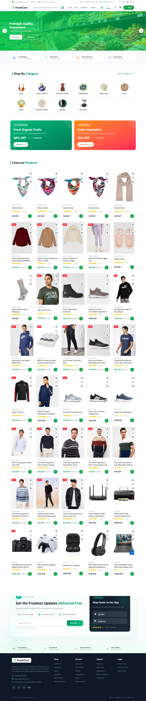
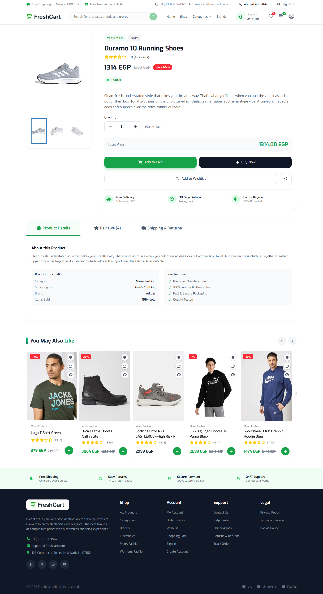
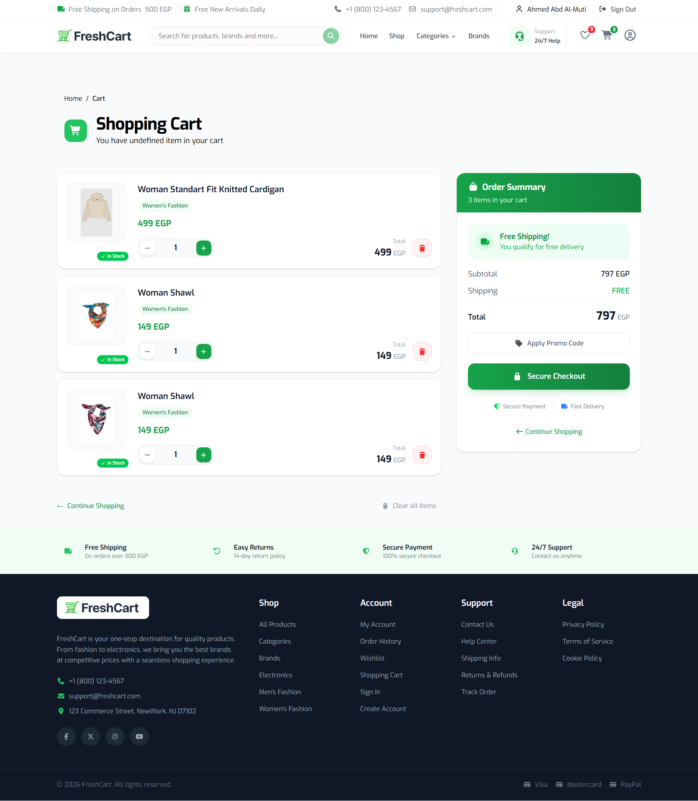
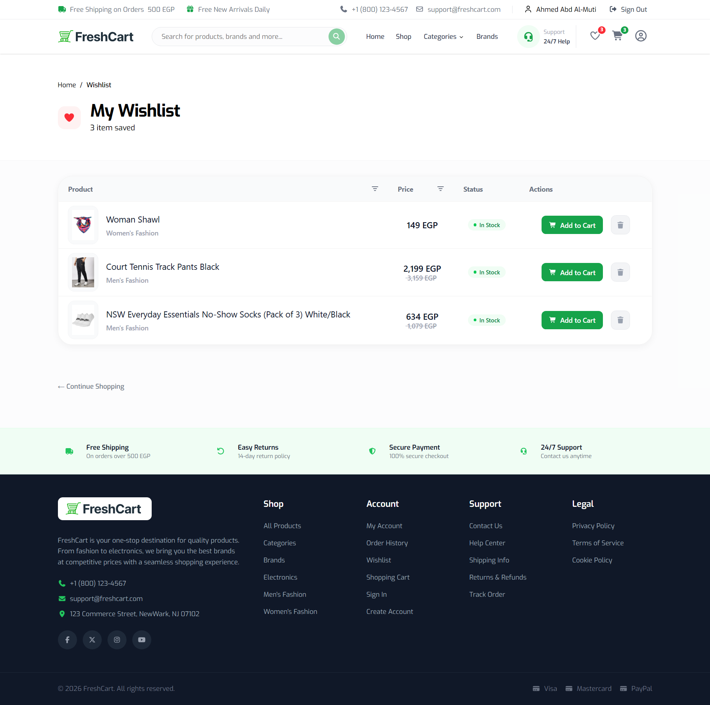

# 🛒 FreshMart - Modern E-Commerce Platform


A modern, responsive e-commerce application built with Next.js and React, featuring authentication, product management, shopping cart, wishlist, and a clean user experience.

## ✨ Features

- Authentication
- Product Catalog
- Categories
- Product Search
- Shopping Cart
- Wishlist
- Responsive Design
- Dark/Light Theme
- Form Validation
- Error Handling
- Loading Skeletons

## 🚀 Tech Stack

- Next.js
- React
- TypeScript
- Tailwind CSS
- Redux Toolkit
- TanStack Query
- React Hook Form
- Zod
- Axios
- NextAuth.js
- shadcn/ui

## 📸 Screenshots

### Home 


### Product 


### Cart 


### Wishlist


## 🏗 Project Structure

src
├── app
├── components
├── features
├── hooks
├── services
├── store
├── types
└── utils

## ⚙️ Installation

```bash
git clone ...
npm install
npm run dev
